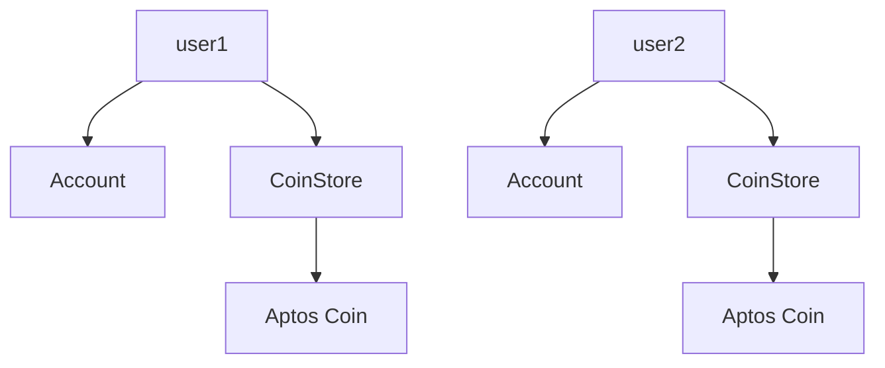
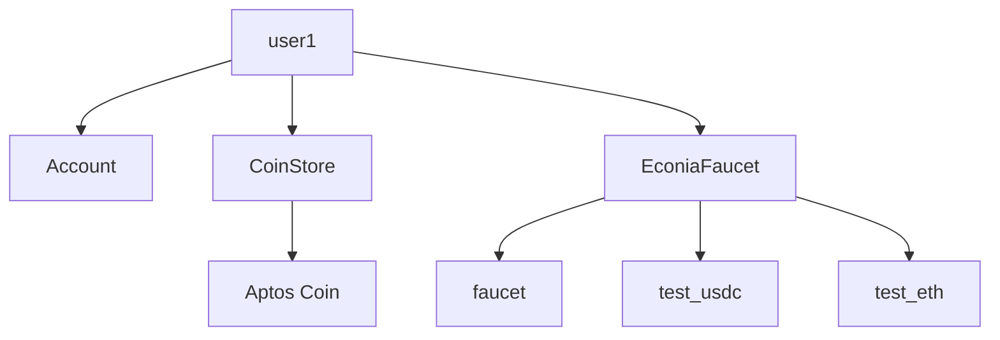
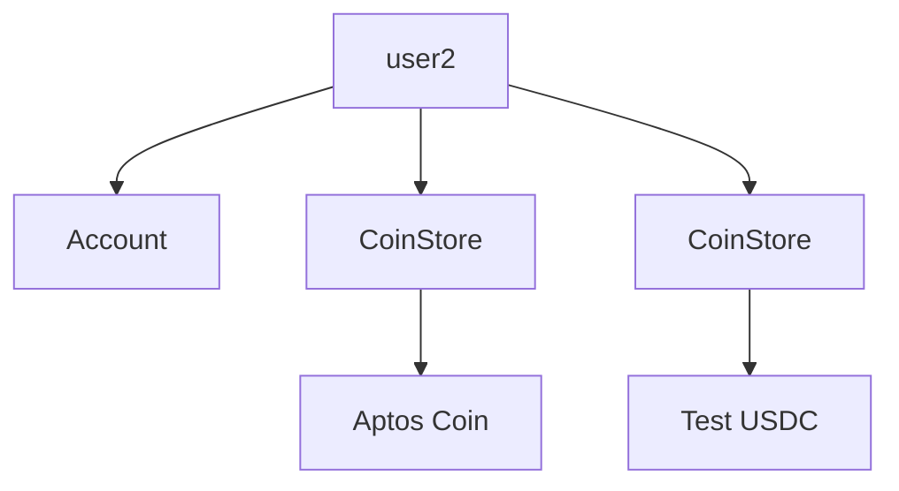

# Econia Workshop: Aptos Hack Holland Amsterdam Hackathon

*June 5, 2023*

- [Econia Workshop: Aptos Hack Holland Amsterdam Hackathon](#econia-workshop-aptos-hack-holland-amsterdam-hackathon)
  - [Resources](#resources)
    - [More documentation](#more-documentation)
    - [Repos](#repos)
  - [User setup](#user-setup)
  - [Faucet setup](#faucet-setup)

## Resources

- This walkthrough [is on GitHub](https://github.com/econia-labs/amsterdam-2023-demo)!

### More documentation

- Econia Labs' [Teach Yourself Move on Aptos](https://github.com/econia-labs/teach-yourself-move) guide
- [Econia Documentation](https://econia.dev/)
- [Econia Move DocGen files](https://github.com/econia-labs/econia/tree/main/src/move/econia/doc)
- [Econia API docs](https://docs.econia.exchange)
- [Econia Move scraps](https://github.com/econia-labs/move-scraps)
- [Aptos Documentation](https://aptos.dev/)

### Repos

- [Econia](https://github.com/econia-labs/econia)
- [Econia indexer](https://github.com/econia-labs/aptos-core/tree/econia) ([`aptos-core`](https://github.com/aptos-labs/aptos-core) fork)
- Econia Labs' [`optivanty`](https://github.com/econia-labs/optivanity) tool
- [Econia reference front end](https://github.com/econia-labs/econia/tree/main/src/typescript/frontend)

## User setup

1. [Install the Aptos CLI](https://aptos.dev/tools/install-cli/):

```bash
brew install aptos
```

2. Use the CLI to initialize two testnet users:

```bash
aptos init --profile user1
```

```bash
aptos init --profile user2
```

3. Store their addresses in shell variables:

```bash
# Make sure to use a leading 0x
user1=0xabc123...
user2=0xdef456...
```

4. Look up their accounts on the [testnet explorer](https://explorer.aptoslabs.com/?network=testnet):



## Faucet setup

1. Clone the Econia repo and move to the Econia faucet directory:

```bash
mkdir econia_demo
cd econia_demo
git clone https://github.com/econia-labs/econia.git
cd econia/src/move/faucet
```

2. Publish the faucet under user1's account:

```
aptos move publish \
    --named-addresses econia_faucet=$user1 \
    --profile=user1
```



3. Mint test USDC to user2's account:

```bash
aptos move run \
    --function-id $user1::faucet::mint \
    --args u64:12345678 \
    --type-args $user1::test_usdc::TestUSDC \
    --profile user2
```


